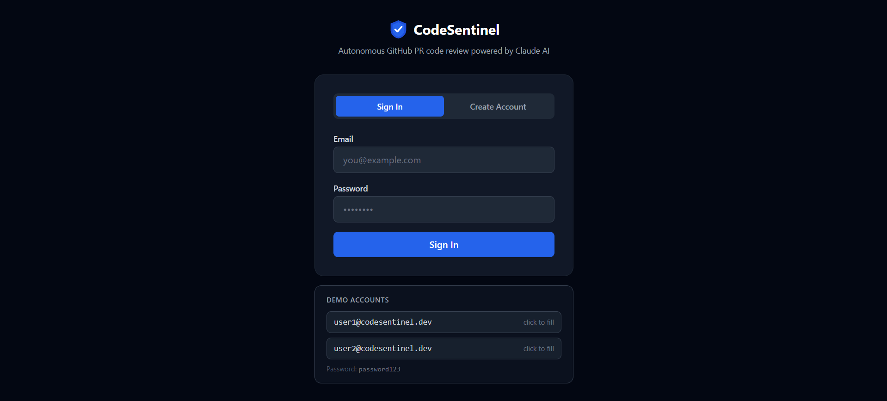
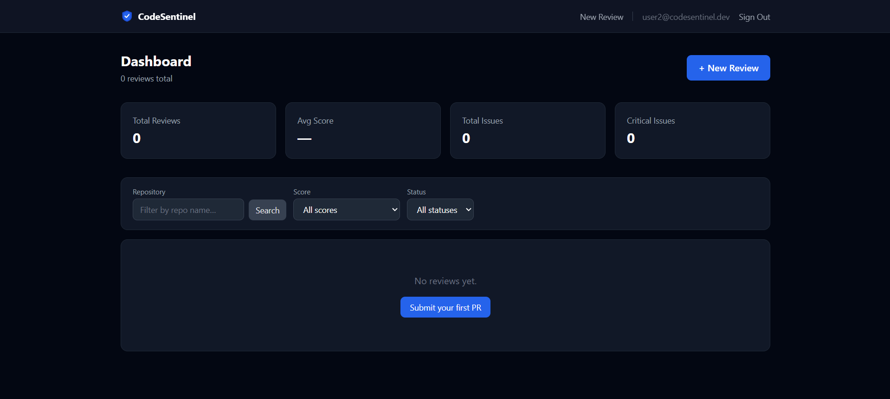
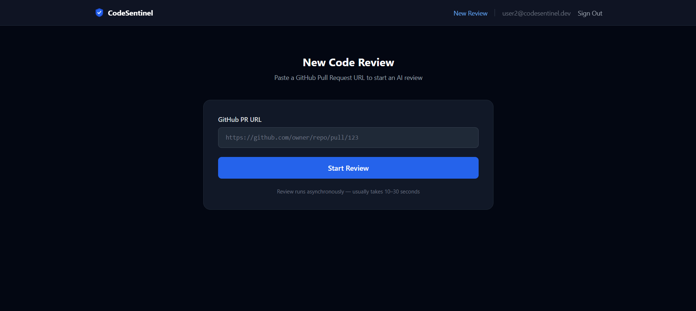
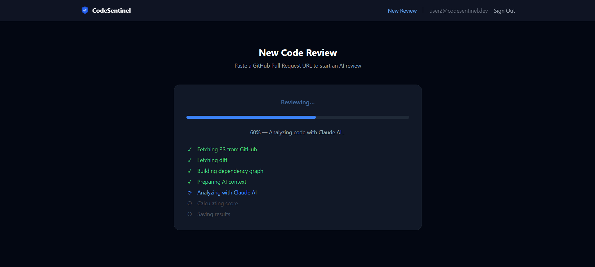
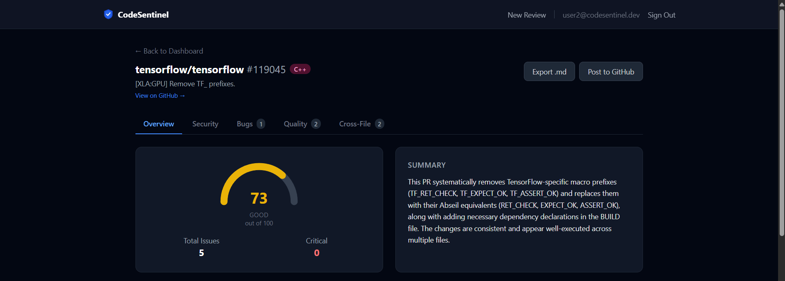
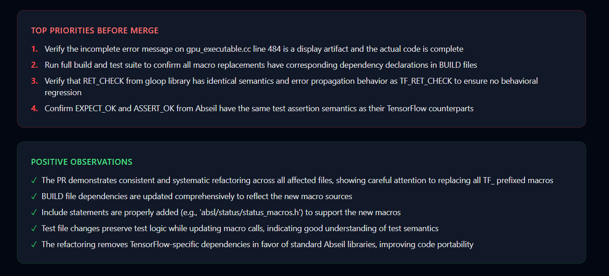
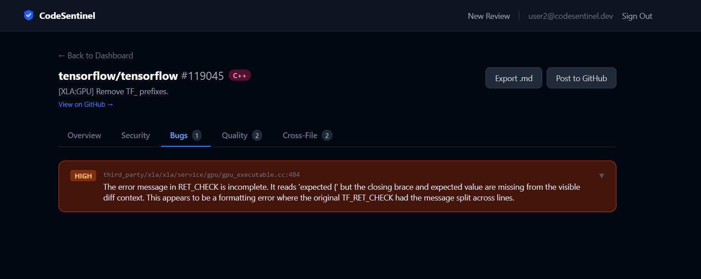
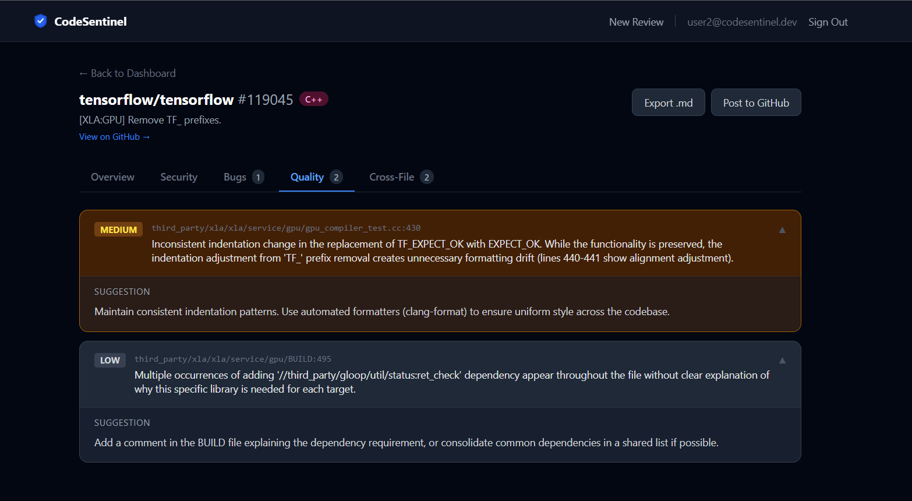
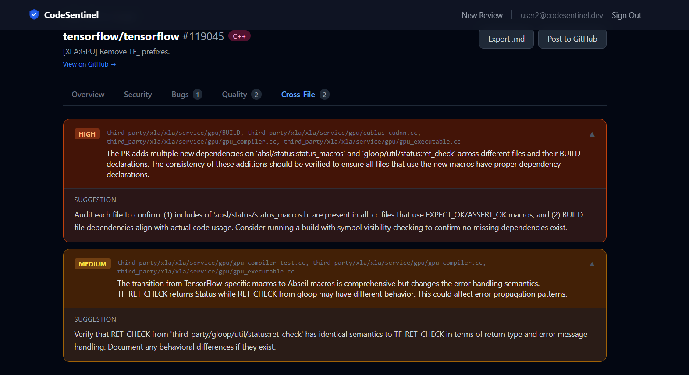

# CodeSentinel

An autonomous GitHub pull request review agent powered by Claude AI. Submit any public PR URL and receive a structured code review covering security vulnerabilities, bugs, quality issues, and cross-file dependency problems — with a 0–100 quality score and the option to post the review directly as a GitHub comment.

**Live demo:** https://codesentinel-nu.vercel.app

| | |
|---|---|
| Frontend | https://codesentinel-nu.vercel.app |
| Backend API | https://codesentinel-q4ob.onrender.com |
| API docs | https://codesentinel-q4ob.onrender.com/docs |

Demo credentials: `user1@codesentinel.dev` / `password123`

---

## Tech Stack

| Layer | Technology | Version |
|---|---|---|
| Backend API | FastAPI | 0.111 |
| Runtime | Python | 3.11 |
| AI | Anthropic Claude (claude-haiku-4-5) | via `anthropic` 0.28 |
| Task Queue | FastAPI BackgroundTasks + Redis pub/sub | — |
| Database | PostgreSQL + SQLAlchemy async | 15-alpine / 2.0 |
| Migrations | Alembic | 1.13 |
| Auth | JWT (python-jose) + bcrypt | — |
| Frontend | React + Vite | 18 / 5 |
| Styling | Tailwind CSS | 3.4 |
| Hosting | Render (backend) + Vercel (frontend) | — |

---

## Architecture

```
┌─────────────┐     HTTPS      ┌──────────────────────────────────────────┐
│   Browser   │ ─────────────► │         React / Vite (Vercel)            │
│  (React)    │                │  Dashboard · NewReview · ReviewResult     │
└─────────────┘                └────────────────┬─────────────────────────┘
                                                │ REST + SSE
                                                ▼
                               ┌──────────────────────────────────────────┐
                               │         FastAPI Backend (Render)         │
                               │  /api/auth   /api/reviews   /api/github  │
                               │                                          │
                               │  BackgroundTasks → ReviewPipeline.run()  │
                               │  1. Fetch PR metadata (GitHub API)       │
                               │  2. Fetch unified diff                   │
                               │  3. Build file dependency graph          │
                               │  4. Truncate diff to token budget        │
                               │  5. Send to Claude for structured review │
                               │  6. Calculate score (0–100)              │
                               │  7. Persist issues to PostgreSQL         │
                               │  8. Publish progress via Redis pub/sub   │
                               └──────┬──────────────┬────────────────────┘
                                      │              │
                             pub/sub  │              │  async ORM
                                      ▼              ▼
                               ┌────────────┐  ┌──────────────┐
                               │  Upstash   │  │  Supabase    │
                               │   Redis    │  │  PostgreSQL  │
                               │  pub/sub   │  │   reviews    │
                               └────────────┘  └──────────────┘
```

### Review Pipeline

When a PR URL is submitted:

1. **Fetch** — PR metadata and unified diff are retrieved from the GitHub API
2. **Dependency graph** — import/require relationships across changed files are parsed to detect cross-file impact
3. **Truncation** — the diff is capped at `MAX_DIFF_TOKENS` tokens and `MAX_FILES_PER_REVIEW` files to fit the model context window
4. **AI analysis** — Claude receives the diff, PR title, file list, and dependency graph and returns a structured JSON review covering security issues, bugs, quality problems, cross-file issues, positive observations, and top priorities
5. **Scoring** — a 0–100 score is calculated from the count and severity of issues found
6. **Persistence** — results are written to PostgreSQL; each issue is stored as a separate row
7. **Progress streaming** — the worker publishes step events to a Redis pub/sub channel; the frontend subscribes via SSE (`/api/reviews/{id}/progress`) and renders a live progress bar

Results are cached in Redis by PR URL (`REDIS_CACHE_TTL` seconds) so repeated reviews of the same PR skip the AI call.

---

## Prerequisites

- Docker Desktop
- Python 3.11+
- Node.js 18+
- An [Anthropic API key](https://console.anthropic.com) (optional — set `AI_MOCK=true` to skip)
- A GitHub personal access token (optional — increases API rate limits)

---

## Local Setup

### 1. Clone and enter the repo

```bash
git clone https://github.com/SidR-13/CodeSentinel.git
cd CodeSentinel
```

### 2. Start PostgreSQL and Redis

```bash
docker compose up postgres redis -d
```

### 3. Configure the backend

```bash
cp backend/.env.example backend/.env
```

Edit `backend/.env` — at minimum set:

```
SECRET_KEY=<any long random string>
ANTHROPIC_API_KEY=<your key, or leave blank and set AI_MOCK=true>
```

### 4. Create a virtual environment and run migrations

```bash
cd backend
python -m venv .venv
source .venv/bin/activate        # Windows: .venv\Scripts\activate
pip install -r requirements.txt
alembic upgrade head
```

### 5. Start the backend API

```bash
uvicorn app.main:app --reload --port 8000
```

### 6. Configure and start the frontend

```bash
cd frontend
cp .env.example .env.local
npm install
npm run dev
```

Open [http://localhost:5173](http://localhost:5173).

---

### Docker Compose (full stack)

To run everything in containers:

```bash
cp backend/.env.example backend/.env
# Edit backend/.env with your secrets

docker compose up --build
```

Services:
- Frontend: [http://localhost:5173](http://localhost:5173)
- Backend API: [http://localhost:8000](http://localhost:8000)
- API docs: [http://localhost:8000/docs](http://localhost:8000/docs)

---

## Environment Variables

### Backend (`backend/.env`)

| Variable | Required | Default | Description |
|---|---|---|---|
| `DATABASE_URL` | Yes | — | PostgreSQL connection string |
| `REDIS_URL` | Yes | `redis://localhost:6379` | Redis connection string |
| `SECRET_KEY` | Yes | — | JWT signing secret (generate with `openssl rand -hex 32`) |
| `ALGORITHM` | No | `HS256` | JWT algorithm |
| `ACCESS_TOKEN_EXPIRE_MINUTES` | No | `1440` | Token TTL (24 hours) |
| `AI_MOCK` | No | `true` | Set to `false` to use real Claude AI |
| `ANTHROPIC_API_KEY` | If `AI_MOCK=false` | — | Anthropic API key |
| `CLAUDE_MODEL` | No | `claude-haiku-4-5-20251001` | Claude model ID |
| `GITHUB_TOKEN` | No | — | GitHub PAT for higher API rate limits |
| `MAX_DIFF_TOKENS` | No | `3000` | Max tokens sent to Claude per review |
| `MAX_FILES_PER_REVIEW` | No | `10` | Max files included in a review |
| `REDIS_CACHE_TTL` | No | `3600` | Seconds to cache review results |
| `CORS_ORIGINS` | No | `["http://localhost:5173"]` | Allowed CORS origins (JSON array or comma-separated) |

### Frontend (`frontend/.env.local`)

| Variable | Required | Default | Description |
|---|---|---|---|
| `VITE_API_URL` | No | `http://localhost:8000` | Backend API base URL |

---

## API Reference

All endpoints except `/api/auth/register` and `/api/auth/login` require a Bearer token:

```
Authorization: Bearer <access_token>
```

### Auth

| Method | Path | Description |
|---|---|---|
| `POST` | `/api/auth/register` | Register a new account |
| `POST` | `/api/auth/login` | Login, returns JWT |
| `GET` | `/api/auth/me` | Current user profile |

### Reviews

| Method | Path | Description |
|---|---|---|
| `POST` | `/api/reviews` | Submit a PR for review |
| `GET` | `/api/reviews` | List reviews (filterable by repo, status, score range) |
| `GET` | `/api/reviews/stats` | Aggregate stats for the current user |
| `GET` | `/api/reviews/{id}` | Full review detail with all issues |
| `DELETE` | `/api/reviews/{id}` | Delete a review |
| `GET` | `/api/reviews/{id}/progress` | SSE stream of review progress events |
| `POST` | `/api/reviews/{id}/post-comment` | Post the review as a GitHub PR comment |

### GitHub

| Method | Path | Description |
|---|---|---|
| `POST` | `/api/github/validate` | Validate a PR URL and fetch its metadata |

### Health

| Method | Path | Description |
|---|---|---|
| `GET` | `/health` | Service health check |

---

## Screenshots

### Login


### Dashboard (empty state)


### Submit a PR for Review


### Live Progress Stream


### Review Result — Overview



### Review Result — Bugs


### Review Result — Quality & Cross-File



---

## License

MIT
